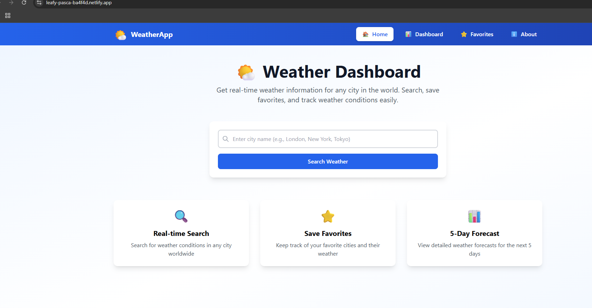
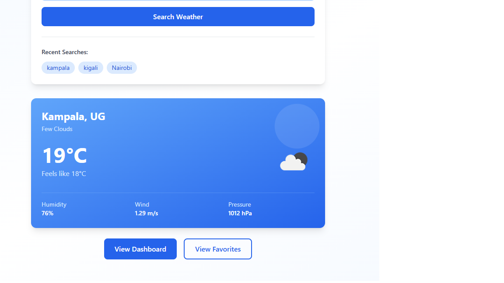
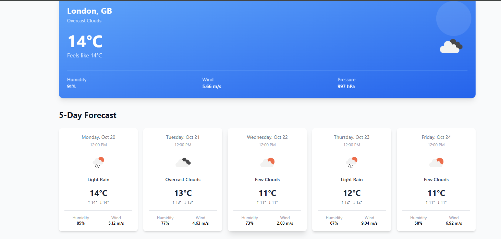

# 🌤️ Weather Dashboard - React.js & Tailwind CSS

A modern, responsive weather application built with **React.js**, **Vite**, and **Tailwind CSS**. Get real-time weather information and 5-day forecasts for cities around the world using the OpenWeather API.

  

## 📋 Table of Contents

- [Features](#features)
- [Demo](#demo)
- [Screenshots](#screenshots)
- [Prerequisites](#prerequisites)
- [Installation](#installation)
- [Configuration](#configuration)
- [Usage](#usage)
- [Project Structure](#project-structure)
- [Technologies Used](#technologies-used)
- [API Integration](#api-integration)
- [Components](#components)
- [Hooks](#hooks)
- [Deployment](#deployment)
- [Contributing](#contributing)
- [License](#license)

## ✨ Features

- 🔍 **Real-Time Weather Search** - Search for current weather in any city worldwide
- 📊 **5-Day Forecast** - View detailed weather forecasts with hourly data
- ⭐ **Favorites System** - Save favorite cities for quick access
- 🌡️ **Temperature Units** - Toggle between Celsius and Fahrenheit
- 📱 **Fully Responsive** - Works seamlessly on desktop, tablet, and mobile
- 💾 **Local Storage** - Persistent favorites and preferences
- 🎨 **Modern UI/UX** - Beautiful gradient designs with smooth animations
- 🚀 **Fast Performance** - Built with Vite for lightning-fast development
- ♿ **Accessible** - WCAG compliant with proper ARIA labels

## 🚀 Demo

**Live Demo:** (https://plp-mern-stack-development.github.io/react-js-jsx-and-css-mastering-front-end-development-emutua23/)

## 📸 Screenshots

### 🌤️ Home Page


### 🌦️ Weather Details


### 📊 5-Day Forecast


## 📦 Prerequisites

Before you begin, ensure you have the following installed:

- **Node.js** (v18 or higher) - [Download here](https://nodejs.org/)
- **npm** (v9 or higher) or **yarn**
- **Git** - [Download here](https://git-scm.com/)
- A modern web browser (Chrome, Firefox, Safari, Edge)
- Code editor (VS Code recommended)

## 🛠️ Installation

### Step 1: Clone the Repository

```bash
# Clone from GitHub Classroom or your repository
git clone <your-repository-url>
cd <repository-name>
```

### Step 2: Install Dependencies

```bash
# Using npm
npm install

# Or using yarn
yarn install
```

This will install all required packages:
- `react` & `react-dom` - React library
- `react-router-dom` - Routing
- `axios` - HTTP client
- `tailwindcss` - CSS framework
- `vite` - Build tool

### Step 3: Get OpenWeather API Key

1. Visit [OpenWeather API](https://openweathermap.org/api)
2. Sign up for a free account
3. Navigate to **API Keys** section
4. Copy your API key

### Step 4: Configure Environment Variables

```bash
# Copy the example environment file
cp .env.example .env
```

Edit `.env` file and add your API key:

```env
VITE_WEATHER_API_KEY=your_actual_api_key_here
VITE_WEATHER_BASE_URL=https://api.openweathermap.org/data/2.5
```

⚠️ **Important:** Never commit your `.env` file to Git!

### Step 5: Start Development Server

```bash
npm run dev
```

Open your browser and navigate to: `http://localhost:5173/`

## ⚙️ Configuration

### Tailwind CSS Configuration

The `tailwind.config.js` file includes:
- Custom color palette
- Custom animations (fade-in, slide-up)
- Extended theme configuration

### Vite Configuration

The `vite.config.js` is pre-configured for React with:
- Fast Hot Module Replacement (HMR)
- Optimized build output
- Environment variable support

## 📖 Usage

### Searching for Weather

1. **Home Page:**
   - Enter a city name in the search bar
   - Click "Search Weather" button
   - View current weather information

2. **Dashboard:**
   - Search for any city
   - View current weather and 5-day forecast
   - Toggle temperature units (°C / °F)

### Managing Favorites

1. Search for a city in the Dashboard
2. Click "Add to Favorites" button
3. View all favorites in the **Favorites** page
4. Remove favorites by clicking the X button

### Temperature Units

- Click the temperature unit toggle button in the Dashboard
- Switch between Celsius (°C) and Fahrenheit (°F)
- Preference is saved in local storage

## 📁 Project Structure

```
react-weather-app/
├── node_modules/          # Dependencies
├── public/                # Static assets
├── src/
│   ├── api/              # API integration
│   │   └── weatherApi.js # Weather API functions
│   ├── components/       # Reusable UI components
│   │   ├── Button.jsx
│   │   ├── Card.jsx
│   │   ├── Input.jsx
│   │   ├── Loading.jsx
│   │   ├── Navbar.jsx
│   │   ├── WeatherCard.jsx
│   │   └── ForecastCard.jsx
│   ├── context/          # React Context
│   │   └── WeatherContext.jsx
│   ├── hooks/            # Custom React hooks
│   │   ├── useFetch.js
│   │   ├── useLocalStorage.js
│   │   └── useGeolocation.js
│   ├── pages/            # Page components
│   │   ├── Home.jsx
│   │   ├── Dashboard.jsx
│   │   ├── Favorites.jsx
│   │   └── About.jsx
│   ├── utils/            # Utility functions
│   │   └── helpers.js
│   ├── App.jsx           # Main app component
│   ├── main.jsx          # Entry point
│   └── index.css         # Global styles
├── .env                  # Environment variables (create this)
├── .env.example          # Environment template
├── .gitignore           # Git ignore rules
├── index.html           # HTML template
├── package.json         # Dependencies & scripts
├── tailwind.config.js   # Tailwind configuration
├── postcss.config.js    # PostCSS configuration
├── vite.config.js       # Vite configuration
└── README.md            # This file
```

## 🔧 Technologies Used

### Core Technologies

- **[React.js](https://react.dev/)** (v18.3) - JavaScript library for building user interfaces
- **[Vite](https://vitejs.dev/)** (v5.4) - Next-generation frontend build tool
- **[Tailwind CSS](https://tailwindcss.com/)** (v3.4) - Utility-first CSS framework

### Libraries & Tools

- **[React Router](https://reactrouter.com/)** (v6) - Declarative routing for React
- **[Axios](https://axios-http.com/)** (v1) - Promise-based HTTP client
- **[OpenWeather API](https://openweathermap.org/api)** - Weather data provider

### Development Tools

- **[ESLint](https://eslint.org/)** - Code linting
- **[PostCSS](https://postcss.org/)** - CSS processing
- **[Autoprefixer](https://autoprefixer.github.io/)** - Automatic vendor prefixing

## 🌐 API Integration

### OpenWeather API Endpoints Used

1. **Current Weather Data**
   ```javascript
   GET /weather?q={city}&appid={API_KEY}&units=metric
   ```

2. **5-Day Forecast**
   ```javascript
   GET /forecast?q={city}&appid={API_KEY}&units=metric
   ```

3. **Weather by Coordinates**
   ```javascript
   GET /weather?lat={lat}&lon={lon}&appid={API_KEY}&units=metric
   ```

### API Service (`src/api/weatherApi.js`)

```javascript
// Get current weather
getCurrentWeather(city)

// Get 5-day forecast
getWeatherForecast(city)

// Get weather by coordinates
getWeatherByCoords(lat, lon)

// Search cities
searchCities(query)
```

## 🧩 Components

### Reusable Components

1. **Button** - Customizable button with variants
   - Props: `children`, `variant`, `onClick`, `disabled`
   - Variants: primary, secondary, danger, outline

2. **Card** - Container component with shadow and hover effects
   - Props: `title`, `children`, `className`, `onClick`

3. **Input** - Form input with label, icon, and error handling
   - Props: `type`, `placeholder`, `value`, `onChange`, `error`, `label`, `icon`

4. **Loading** - Loading spinner with customizable size
   - Props: `size`, `message`

5. **Navbar** - Navigation bar with active link highlighting
   - Routes: Home, Dashboard, Favorites, About

6. **WeatherCard** - Displays current weather information
   - Props: `weather`, `unit`, `onRemove`

7. **ForecastCard** - Displays forecast data
   - Props: `forecast`, `unit`

## 🪝 Hooks

### Custom Hooks

1. **useFetch** - Generic data fetching hook
   ```javascript
   const { data, loading, error, refetch } = useFetch(fetchFunction, dependencies);
   ```

2. **useLocalStorage** - Persistent state management
   ```javascript
   const [value, setValue] = useLocalStorage('key', initialValue);
   ```

3. **useGeolocation** - Get user's location
   ```javascript
   const { position, error, loading } = useGeolocation();
   ```

### React Context

**WeatherContext** - Global state management
- Favorites management
- Temperature unit preference
- Recent searches tracking

## 🚀 Deployment

### Deploy to Vercel (Recommended)

1. **Install Vercel CLI**
   ```bash
   npm install -g vercel
   ```

2. **Login to Vercel**
   ```bash
   vercel login
   ```

3. **Deploy**
   ```bash
   vercel
   ```

4. **Add Environment Variables**
   - Go to Vercel Dashboard
   - Navigate to Project Settings → Environment Variables
   - Add `VITE_WEATHER_API_KEY`

5. **Redeploy**
   ```bash
   vercel --prod
   ```

### Deploy to Netlify

1. **Build the project**
   ```bash
   npm run build
   ```

2. **Deploy**
   - Go to [Netlify](https://www.netlify.com/)
   - Drag and drop the `dist` folder
   - Or connect your Git repository

3. **Add Environment Variables**
   - Go to Site Settings → Environment Variables
   - Add `VITE_WEATHER_API_KEY`

### Deploy to GitHub Pages

1. **Install gh-pages**
   ```bash
   npm install --save-dev gh-pages
   ```

2. **Update package.json**
   ```json
   {
     "homepage": "https://<username>.github.io/<repo-name>",
     "scripts": {
       "predeploy": "npm run build",
       "deploy": "gh-pages -d dist"
     }
   }
   ```

3. **Update vite.config.js**
   ```javascript
   export default defineConfig({
     base: '/<repo-name>/',
     plugins: [react()],
   })
   ```

4. **Deploy**
   ```bash
   npm run deploy
   ```

## 📝 Available Scripts

```bash
# Start development server
npm run dev

# Build for production
npm run build

# Preview production build
npm run preview

# Lint code
npm run lint
```

## 🧪 Testing the Application

### Manual Testing Checklist

- [ ] Home page loads correctly
- [ ] Search functionality works
- [ ] Weather data displays properly
- [ ] Dashboard shows forecast
- [ ] Can add cities to favorites
- [ ] Can remove cities from favorites
- [ ] Temperature unit toggle works
- [ ] Responsive design on mobile
- [ ] Recent searches appear
- [ ] Error handling works
- [ ] Loading states display

## 🐛 Troubleshooting

### Common Issues

1. **API Key Error**
   - Verify your API key in `.env` file
   - Check if the key is active (may take 10 minutes after creation)
   - Ensure the key is prefixed with `VITE_`

2. **Tailwind Styles Not Working**
   - Check `tailwind.config.js` content paths
   - Verify `@tailwind` directives in `index.css`
   - Restart development server

3. **Build Fails**
   - Clear `node_modules` and reinstall: `rm -rf node_modules && npm install`
   - Check for missing dependencies in `package.json`
   - Update all packages: `npm update`

4. **CORS Errors**
   - OpenWeather API supports CORS by default
   - If using a different API, check CORS settings
   - Consider using a proxy for development

## 📚 Learning Resources

- [React Documentation](https://react.dev/)
- [Tailwind CSS Documentation](https://tailwindcss.com/docs)
- [Vite Documentation](https://vitejs.dev/guide/)
- [React Router Documentation](https://reactrouter.com/en/main)
- [OpenWeather API Documentation](https://openweathermap.org/api)

## 🤝 Contributing

Contributions are welcome! Please follow these steps:

1. Fork the repository
2. Create a feature branch: `git checkout -b feature/amazing-feature`
3. Commit your changes: `git commit -m 'Add amazing feature'`
4. Push to the branch: `git push origin feature/amazing-feature`
5. Open a Pull Request

## 📄 License

This project is created for educational purposes as part of a React.js and Tailwind CSS assignment.

## 👨‍💻 Author

**Your Name**
- GitHub: [@emutua23](hhttps://github.com/PLP-MERN-Stack-Development/react-js-jsx-and-css-mastering-front-end-development-emutua23)
- Email: emanuel.mutua@gmail.com

## 🙏 Acknowledgments

- OpenWeather API for weather data
- React team for the amazing framework
- Tailwind CSS for the utility-first CSS framework
- Vite team for the blazing-fast build tool

---

## 📊 Assignment Submission Checklist

Before submitting your assignment, ensure:

- [x] All components are reusable and well-documented
- [x] State management implemented using React hooks
- [x] External API integrated (OpenWeather API)
- [x] Tailwind CSS used for all styling
- [x] Application is fully responsive
- [x] Code is clean with proper comments
- [x] Application deployed to Vercel/Netlify
- [ ] Deployment URL added to this README
- [x] All features working as expected
- [ ] GitHub repository pushed with all changes

---

**Deployment URL:** [Add your deployment URL here after deploying]

**Last Updated:** 2025-10-19

---

Made with ❤️ using React.js and Tailwind CSS
